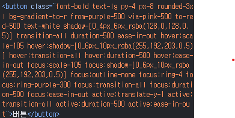

# TailwindCSS에서 동적 클래스 사용하기

TailwindCSS는 유틸리티 기반 스타일링을 매우 빠르고 편하게 만들어주지만, **동적으로 클래스 이름을 만드는 것**은 공식적으로 금지하고 있다.
왜 이런 제한이 있는지, 그리고 실제로 이를 우회하거나 해결할 수 있는 방법이 있는지 탐구하면서 TailwindCSS의 내부 동작을 분석하게 되었다. 이 문서는 그 과정과 이해한 내용을 정리한 것이다.

---

## 1. TailwindCSS에서 동적 클래스가 왜 문제인가?

### 1.1 버튼 스타일링으로 살펴본 TailwindCSS 사용 흐름

기본 버튼 하나를 만드는 과정에서 TailwindCSS의 편리함과 동시에 class 문자열이 점점 길어지는 문제를 쉽게 체감할 수 있다.
<br><br/>1. **기본 버튼 생성**

TailwindCSS의 기본 리셋 스타일 덕분에 버튼은 테두리와 배경이 없어서 처음엔 버튼처럼 보이지 않는다.

```html
<button>버튼</button>
```

<br><br/>2. **기본 스타일 추가**

`border`, `font-bold`, `text-lg`, `py-4`, `px-8` 등 버튼으로 보이기 위한 기본 스타일을 추가한다.

```html
<button className="font-bold text-lg py-4 px-8 border-1 border-black">버튼</button>
```

<br><br/>3. **시각적 요소 강화**

그라디언트, `rounded-xl`, `text-white`, 커스텀 shadow 등을 넣는다.
TailwindCSS의 대괄호 문법을 활용해 쉐도우 값을 직접 지정할 수도 있다.

```html
<button className="font-bold text-lg py-4 px-8 border-1 border-black rounded-3xl bg-gradient-to-r from-purple-500 via-pink-500 to-red-500 text-white shadow-[0_4px_6px_rgba(128,0,128,0.5)]">버튼</button>
```

<br><br/>4. **상태별 스타일 추가 (hover, focus, active)**

hover 시 scale 적용, focus 시 outline 제거 및 애니메이션, active 시 살짝 눌리는 효과 등 상태가 늘어날수록 class 문자열은 기하급수적으로 길어진다.

```html
<button className="font-bold text-lg py-4 px-8 rounded-3xl bg-gradient-to-r from-purple-500 via-pink-500 to-red-500 text-white shadow-[0_4px_6px_rgba(128,0,128,0.5)] hover:scale-105 hover:shadow-[0_6px_10px_rgba(255,192,203,0.5)] focus:scale-105 focus:shadow-[0_6px_10px_rgba(255,192,203,0.5)] focus:outline-none focus:ring-4 focus:ring-purple-300 active:translate-y-1 transition-all duration-500 ease-in-out hover:transition-all hover:duration-500 hover:ease-in-out focus:transition-all focus:duration-500 focus:ease-in-out active:transition-all active:duration-500 active:ease-in-out">버튼</button>
```

결국 하나의 버튼만으로도 **클래스 문자열이 600자까지** 늘어나며, 가독성이나 유지보수 측면에서 불편함이 생긴다.

---

### 1.2 클래스 분리와 객체 기반 관리 시도

이 문제를 해결하기 위해 다음과 같이 구조화해 보았다.
<br></br> 1. **상태별로 클래스 분리**

```js
const styles = {
  base: `
    font-bold text-lg py-4 px-8 rounded-3xl
    bg-gradient-to-r from-purple-500 via-pink-500 to-red-500
    text-white shadow-[0_4px_6px_rgba(128,0,128,0.5)]
    transition-all duration-500 ease-in-out
  `,

  hover: `
    hover:scale-105
    hover:shadow-[0_6px_10px_rgba(255,192,203,0.5)]
    hover:transition-all hover:duration-500 hover:ease-in-out
  `,

  focus: `
    focus:scale-105
    focus:shadow-[0_6px_10px_rgba(255,192,203,0.5)]
    focus:outline-none focus:ring-4 focus:ring-purple-300
    focus:transition-all focus:duration-500 focus:ease-in-out
  `,

  active: `
    active:translate-y-1
    active:transition-all active:duration-500 active:ease-in-out
  `,
};
```

```ts
styles.base;
styles.hover;
styles.focus;
styles.active;
```

이런 식으로 분리하면 구조적 관리가 가능해진다. 실제로 스타일이 잘 입혀진다.
<br></br> 2. **반복되는 접두사 제거**

각 상태별 문자열에서 반복되는 `hover:`, `focus:`, `active:`를 볼 수 있다. TailwindCSS는 이러한 접두사가 매우 많은데, 상태별로 나뉜 문자열들이 모두 같은 접두사를 반복해서 갖고 있으니 유지보수면에서 불편하다고 느꼈다. 그래서 문자열들에 접두사를 제거했다.

```js
const styles = {
  base: `
    font-bold text-lg py-4 px-8 rounded-3xl
    bg-gradient-to-r from-purple-500 via-pink-500 to-red-500
    text-white shadow-[0_4px_6px_rgba(128,0,128,0.5)]
    transition-all duration-500 ease-in-out
  `,

  hover: `
    scale-105
    shadow-[0_6px_10px_rgba(255,192,203,0.5)]
  `,

  focus: `
    scale-105
    shadow-[0_6px_10px_rgba(255,192,203,0.5)]
    outline-none ring-4 ring-purple-300
  `,

  active: `
    translate-y-1
  `,
};
```

그 위 코드보다 더 짧아진 모습이다. 스타일을 추가할 때 상태에 맞게 추가해주면 된다.
<br></br> 3. **하지만 그대로 사용할 수 없음**

예를 들어 `hover:` 같은 접두사가 빠지면 TailwindCSS가 `hover: "scale-105"`를 `hover:scale-105`라고 인식하지 않는다.

```js
const styles = {
    ...
    hover: `scale-105`, // scale-105로 인식
    ...
  };
```

“`scale-105`”는 있지만 “`hover:scale-105`”는 코드에 존재하지 않기 때문이다. 이 인과관계는 후술한다.
<br></br> 4. **접두사를 자동으로 붙여주는 `appendPrefix` 함수 구현**

```ts
// function.ts
export function appendPrefix(prefix: string, str: string) {
  const arr = str.split(" ");
  const newArr = arr.map((e) => preifx + ":" + e);
  const result = newArr.join(" ");
  return result;
}
```

```jsx
const styles = {
  base: `
    font-bold text-lg py-4 px-8 rounded-3xl
    bg-gradient-to-r from-purple-500 via-pink-500 to-red-500
    text-white shadow-[0_4px_6px_rgba(128,0,128,0.5)]
    transition-all duration-500 ease-in-out
  `,

  hover: `
    scale-105
    shadow-[0_6px_10px_rgba(255,192,203,0.5)]
  `,

  focus: `
    scale-105
    shadow-[0_6px_10px_rgba(255,192,203,0.5)]
    outline-none ring-4 ring-purple-300
  `,

  active: `
    translate-y-1
  `,
};

<button
  className={`
            ${styles.base}
             ${appendPrefix("hover", styles.hover)} 
             ${appendPrefix("focus", styles.focus)} 
             ${appendPrefix("active", styles.active)}
             `}
>
  버튼
</button>;
```

`appendPrefix` 함수는 두 개의 문자열 `prefix`, `str`를 인자로 받는다. `prefix`로는 접두사로 쓸 문자열(예를 들면 `hover`)를, `str`로는 공백으로 구분된 문자열(예를 들면 `bg-blue-700 text-black`)이면 된다.
<br></br>5. **겉보기엔 동작하는 것처럼 보이지만…**



DevTools에서는 `button`의 클래스에 접두사가 붙어서 잘 들어간 것처럼 보이지만, 스타일이 적용되지 않는다. 클래스가 생성되지 않았기 때문이다. 즉,

“동적 클래스가 생성된 것”이 아니다.

---

### 1.3 TailwindCSS가 동적 클래스를 허용하지 않음

[TailwindCSS 공식 문서](https://tailwindCSS.com/docs/detecting-classes-in-source-files#dynamic-class-names)에서는 다음과 같은 패턴을 금지한다.

```js
text-${error ? 'red' : 'green'}-600   // ❌ 금지
```

왜냐하면 TailwindCSS는 **완성된 문자열**만 파싱해서 CSS를 생성하기 때문이다.

정확한 이유는 내부 동작 방식에 있다.

#### TailwindCSS의 동작 방식

1. 프로젝트의 일부를 제외한 모든 파일을 통 문자열로 읽는다.
2. 문자열 중에서 “클래스일 가능성이 있는 문자덩어리(토큰)”를 추출한다(토큰화). 대문자, 세미콜론, 괄호 등은 클래스 이름으로 간주하지 않는다.
3. TailwindCSS 내부 사전에 존재하는 클래스인지 비교한다.
4. 일치하는 토큰만 CSS 파일의 유틸리티(Utility) 레이어에 클래스로 추가한다.

따라서 동적으로 문자열을 조합하면 절대 TailwindCSS가 이를 찾지 못한다.

> ".gitignore", "node_modules" 내의 파일, 이미지 / 비디오 / 압축 파일 등의 binary file, CSS 파일, "package-lock.json" / "yarn.lock" 같은 package manager lock files들에서는 찾지 않는다.([해당 내용이 적힌 TailwindCSS 문서](https://tailwindcss.com/docs/detecting-classes-in-source-files#which-files-are-scanned))

---

## 2. 실제로 어떻게 CSS가 생성되는가?

TailwindCSS는 PostCSS 환경에서 플러그인으로 동작한다.

### TailwindCSS 레이어 구조

TailwindCSS의 레이어는 `Base`, `Components`, `Utility`, `Components`로 구성된다.
<br></br>1. **Utility 레이어**

개발자가 작성한 TailwindCSS 클래스들이 토큰으로 인지되어 추가되는 부분이다.
<br></br>2. **Theme 레이어**

TailwindCSS가 내부적으로 `calc()` 함수를 사용하여 변수(예: `spacing` 변수)를 정의하는 곳이다. `margin`과 같은 속성을 사용할 때 필요한 변수들이 이 레이어에 추가된다. 사용하지 않은 변수는 추가되지 않는다.

변수가 정의되는 레이어라서 원하는 변수를 개발자가 추가할 수 있다. ([customizing-your-theme](https://tailwindcss.com/docs/adding-custom-styles#customizing-your-theme))
<br></br>3. **Base 레이어**

`modern-normalize`라는 리셋 CSS 파일을 기반으로 하는 `preflight` 리셋 스타일이 포함된다. TailwindCSS를 사용하는 모든 프로젝트에서 이 `base` 스타일은 동일하게 적용된다. ([preflight github](https://github.com/tailwindlabs/tailwindcss/blob/main/packages/tailwindcss/preflight.css))

리셋 스타일을 적용하는 레이어라서 원하는 스타일을 개발자가 추가할 수 있다. 일반적으로 태그 선택자로 추가한다.([adding-base-styles](https://tailwindcss.com/docs/adding-custom-styles#adding-base-styles))
<br></br>4. **Components 레이어**

개발자가 컴포넌트화해서 추가할 수 있는 레이어다. 자동으로 생성되는 레이어가 아니기 때문에 필요할 경우 직접 레이어를 만들어야 한다.

일반적으로 태그 선택자를 제외한 선택자를 사용하게 된다.

### **PostCSS의 역할**

TailwindCSS는 PostCSS라는 CSS 후처리기를 통해 동작한다.

1. PostCSS는 CSS 파일을 입력받아 새로운 CSS 파일을 만들어내는 역할을 한다.
2. PostCSS 패키지는 다양한 PostCSS 플러그인들을 실행할 수 있게 하는 런타임 환경을 제공한다.
3. TailwindCSS는 PostCSS 플러그인으로 동작하며, `postcss.config.js` 파일에 `tailwindcss/postcss` 플러그인을 넘겨주어 실행된다.
4. `@import "tailwindcss"`가 있는 파일이 이정표 역할을 하고, 이 파일에 레이어를 생성한다.

---

## 3. 동적 클래스를 가능하게 만들기 위한 개인적인 도전

클래스 생성 과정에서 **프로젝트의 일부를 제외한 모든 파일을 통 문자열로 읽는다**

- 예를 들어 `leading-none`과 같은 클래스를 TSX 파일이나 심지어 메모장 파일에 작성해도 TailwindCSS가 이를 인식하여 토큰화한다.

TailwindCSS가 동적 클래스를 읽도록 하려면 **미리 클래스들을 만들어 파일에 넣어두면 된다**는 아이디어가 떠올랐다.

- `hover:scale-105`와 같이 접두사가 붙은 클래스를 미리 생성하여 Tailwind CSS가 이를 인식하도록 하는 것. 즉, 동적으로 생성된 클래스도 TailwindCSS가 인식할 수 있는 방법을 찾고자 한다.

TailwindCSS의 클래스 생성 코드가 PostCSS 위에서 실행되기 전에 접두사를 붙여서 파일을 만드는 코드가 실행되면 동작할 것 같았다. (그래서 PostCSS가 뭔지, 실행 시점은 언제인지 공부한 것이다.)

이를 위해 다음을 시도했다.

### 3.1 Babel 플러그인 개발

- AST를 학습하고
- Babel 플러그인을 직접 구현하여
- 프로젝트 파일을 분석해 자동으로 필요한 TailwindCSS 클래스를 생성하도록 시도했다.

로컬 테스트에서는 `test.txt` 파일에 필요한 클래스를 생성하고 TailwindCSS가 이를 인식해 `globals.css`에 클래스를 생성하는 데 성공했다.

### 3.2 문제 발생

조금 더 다듬으면 Webpack + Babel을 사용하는 환경에서는 사용할 수 있게 된다.

하지만 목표는 Next.js였고, Next.js는 더 이상 Webpack + Babel 환경을 기본으로 사용하지 않는다.

- Next 14 기준

  - 번들러: **Turbopack**
  - 트랜스파일러: **SWC(Rust 기반)**

즉, Babel 플러그인은 Next.js에서는 동작하지 않는다.

### 3.3 Rust 학습 시작

SWC 기반으로 비슷한 기능을 만들기 위해 Rust를 공부하기 시작했다.
여기까지 약 일주일 정도를 투자했고, 아직 초기 단계이지만 구현 가능성은 열려 있다.

---

## 4. 앞으로의 계획

- Turbopack + SWC 환경에서도 동작하는 방식으로
  동적 TailwindCSS 클래스 생성기를 만들어 NPM 패키지로 배포하는 것이 목표다.
- 객체 기반 클래스 관리 패턴을 다양한 컴포넌트에 적용해 재사용성을 높여 볼 예정이다.
- 현재 만든 Babel 버전의 플러그인은 아직 테스트 단계지만, 완성도를 높이면 오픈 소스로 공개할 예정이다.

---
